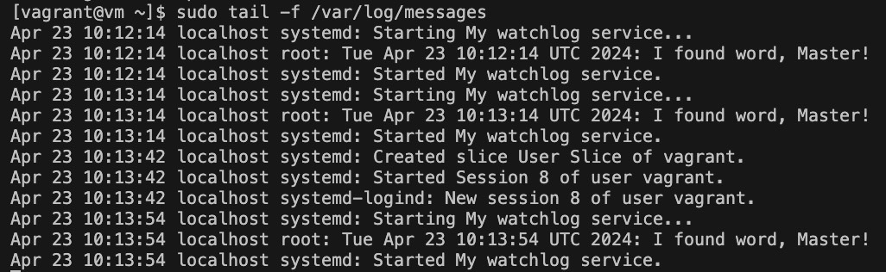

# Systemd

### Описание задачи 
  
Написать сервис, который будет раз в 30 секунд мониторить лог на предмет наличия ключевого слова. Файл и слово должны задаваться в /etc/sysconfig
  
### Создание необходимых файлов конфигурации
  
Для начала создаём файлы с конфигурацией для сервиса в директории /etc/sysconfig - из неё сервис будет брать необходимые переменные.  
```
vi /etc/sysconfig/watchlog  
```  
  
Файл имеет следующее содержание:  
```
# Configuration file for my watchlog service
# Place it to /etc/sysconfig
  
# File and word in that file that we will be monit
WORD="ALERT"
LOG=/var/log/watchlog.log
```  
  
Затем создаем /var/log/watchlog.log и пишем туда строки на своё усмотрение, плюс ключевое слово ‘Alert’  
  
Создадим скрипт:  
```
vi /opt/watchlog.sh
```
  
Crhbgn имеет следующее содержание:  
```
#!/bin/bash

WORD=$1
LOG=$2
DATE=`date`

if grep $WORD $LOG &> /dev/null
then
logger "$DATE: I found word, Master!"
else
exit 0
fi
```
  
Команда logger отправляет лог в системный журнал  
  
Не забываем, что скрипт болжен иметь права на запуск  
  
Создадим юниты:
  
watchlog.timer
```
[Unit]
Description=Run watchlog script every 30 second

[Timer]
# Run every 30 second
OnUnitActiveSec=30
Unit=watchlog.service

[Install]
WantedBy=multi-user.target
```
watchlog.service
```
[Unit]
Description=My watchlog service

[Service]
Type=oneshot
EnvironmentFile=/etc/sysconfig/watchlog
ExecStart=/opt/watchlog.sh $WORD $LOG
```
  
Теперь достаточно запустить timer:
```systemctl start watchlog.timer```
  
И убедиться в результате:
```tail -f /var/log/messages```
  
Результат будет выглядить следующим образом:  

  
Для автоматизированной настройки достаточно запустить стенд командой ```vagrant up```  
и после запуска стенда выполнить ```ansible-playbook ./ansible/playbook.yaml -i ./ansible/hosts.ini```  
Войти на тестову виртальную машину можно с помощью команды ```vagrant ssh default ``` после чего выполнить запуск таймера утилиту tail, команды которые были описаны выше.
  

